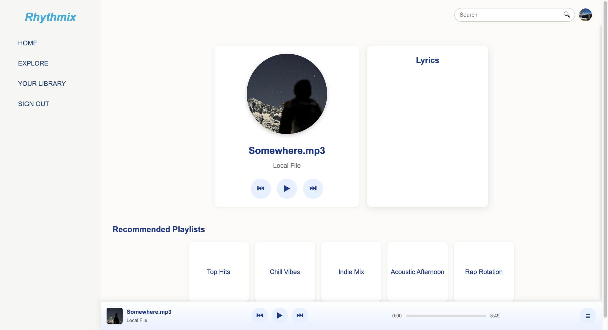
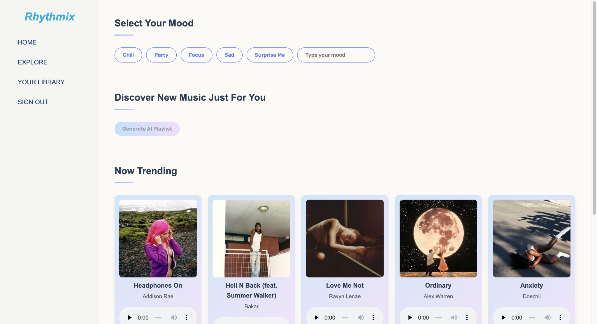
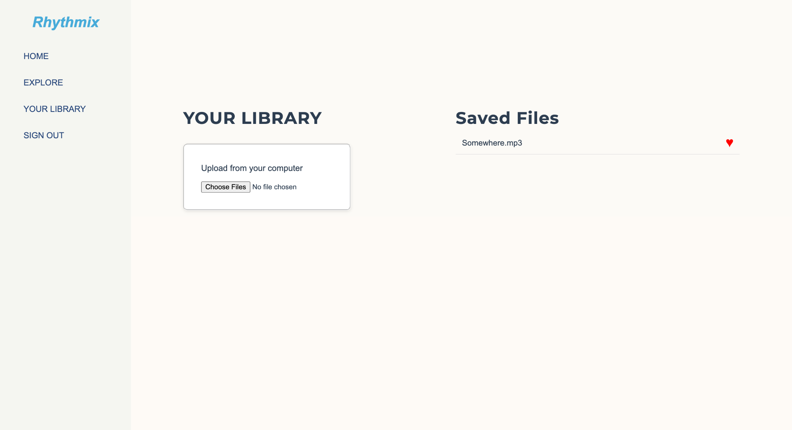

Rhythmix is a full-stack web application that uses AI to recommend music based on your mood. You can explore trending tracks, generate a personalized playlist with Google Gemini, play local files and manage your own library.


The Home page features a search bar for finding any track in playlists or the library. Clicking a result starts playback instantly. The persistent bottom player shows album art, track title, artist name, and playback controls.

 
The Explore page includes a mood selector and a text input for entering custom moods. After clicking "Generate," a personalized AI playlist powered by Google Gemini appears. At the bottom of the page, the Deezer API fetches current trending tracks, displaying cover art, title, and artist, each with an “Add to Queue” button.


The Library section allows uploading MP3 files to create a personal collection. From any device, users can browse their library, play or pause tracks, and remove songs as needed.

## Tech Stack

- **Frontend:** HTML, CSS, JavaScript  
- **Backend:** Node.js with Express  
- **Music Recommendation:** Deezer API & Google Gemini  
- **Authentication:** Firebase Authentication  
- **File Uploads:** Multer (Express middleware)

**Clone the repo**  
```bash
git clone https://github.com/yubin2005/Rhythmix.git
cd Rhythmix/Music-App/server
